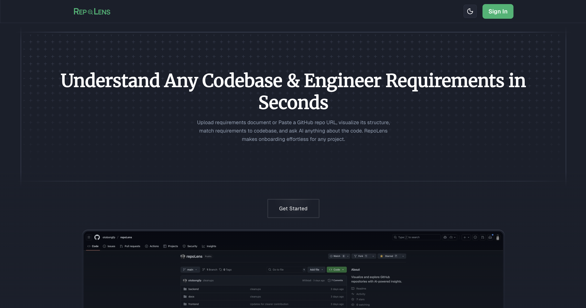

# RepoLens

> **Open Source AI-Powered Requirements Engineering & Codebase Analysis Tool**

RepoLens is an **open source AI-powered requirements engineering and codebase analysis tool** that analyzes repositories to provide clear, actionable insights for developers, product leaders, and teams. By combining **advanced code analysis**, **requirement mapping**, and **intelligent project management**, RepoLens helps developers understand complex codebases, identify technical debt, and ensure code quality across projects.

Whether you're joining a new project with a large repo or analyzing existing codebases, RepoLens provides the tools to **understand, analyze, and improve** code quality through AI-powered insights and requirement mapping.

## Contributing

We welcome contributions! Please see our [Contributing Guidelines](docs/CONTRIBUTING.md) for details.

- Check issues labeled **good first issue** or **help wanted**
- Improve analysis accuracy, visualization quality, or user experience
- Add new analysis types, integrations, or enterprise features

---

## License

This project is licensed under the **GNU Affero General Public License v3.0 (AGPL-3.0)** - see the [LICENSE](LICENSE) file for details.

For commercial use or enterprise licensing, please contact the maintainers.
